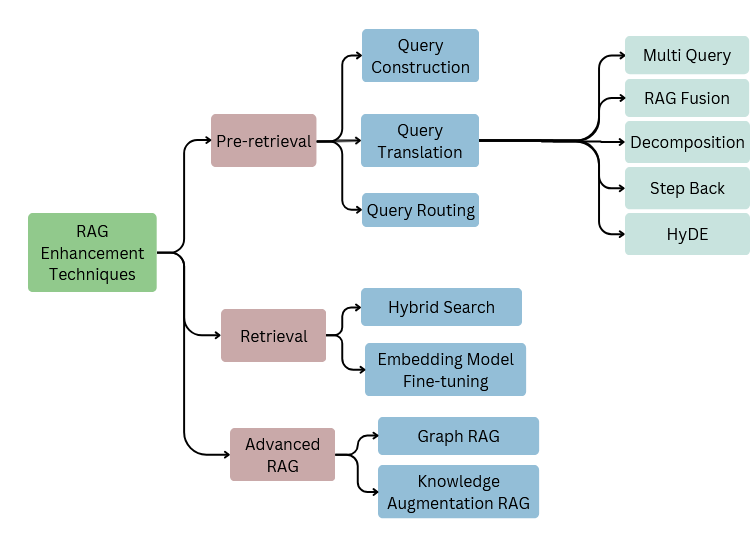

# Retrieval-Augmented Generation (RAG) Techniques

## Overview
This repository explores various **Retrieval-Augmented Generation (RAG)** techniques, which enhance large language models (LLMs) by integrating retrieval mechanisms. RAG improves response accuracy, relevance, and factual consistency by leveraging external knowledge sources during inference.

## Features
- Implementation of different RAG architectures (e.g., standard RAG, hierarchical RAG, chunk-based retrieval).
- Comparison of pre-retrieval strategies 
- Fine-tuning methodologies for improving generation quality.

  
